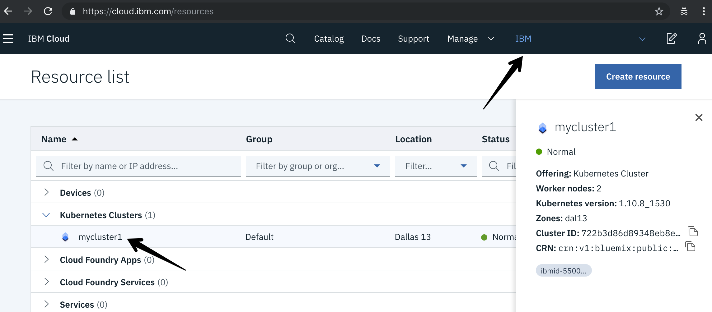

# Get Started
In this section, you will create your own IBM Cloud account, and then get access to a IBM Cloud Lab account which contains pre-provisioned clusters. Each lab attendee will be granted access to one cluster.

1. Create your own [IBM Cloud account](https://cloud.ibm.com/registration/?cm_mmc=Email_Events-_-Developer_Innovation-_-WW_WW-_-beemarie%5Crtpserverlessmeetup-durham-592019%5CMay2019%5Cmeetup%5Cglobal-devadvgrp%5Cdurham%5Cunitedstates%5C%5Cknative-101-labs&cm_mmca1=000019RS&cm_mmca2=10004805&cm_mmca3=M99938765&eventid=5cd2f6551414a497357d2fe4&cvosrc=email.Events.M99938765&cvo_campaign=000019RS).
2. After the email verification, confirm by logging in to https://cloud.ibm.com
3. Go to the [Get Cluster](https://knative-rtp.mybluemix.net/) web page and enter your IBM ID (the email you used to sign up), the lab key from the instructor, and select the `us-east` region.

    

3. You will be added to the IBM Lab account and granted access to a cluster. Note the name of your cluster. It will be something like: `knative-rtp1`
4. Refresh your [IBM Cloud Dashboard](https://cloud.ibm.com)
5. Switch to the **IBM** account by clicking on the account selection drop down in the top nav bar.
6. Click on **Kubernetes Clusters** in the Resource Summary tile.

    

7. Under **Kubernetes Clusters**, click on the cluster that has been assigned to you.

    

8. This page has some overview information about your cluster, including an **ingress subdomain** that you will need later on in the lab. Make note of the **ingress subdomain.** It should look something like `knative-workshop3.wdc03.containers.appdomain.cloud`.

You will use this cluster for this lab. Note the name of your cluster as well as the ingress subdomain for use in later steps. Note that this is a *Standard/Paid* cluster (as opposed to FREE cluster.)

Continue on to [exercise 1](../exercise-1/README.md).
