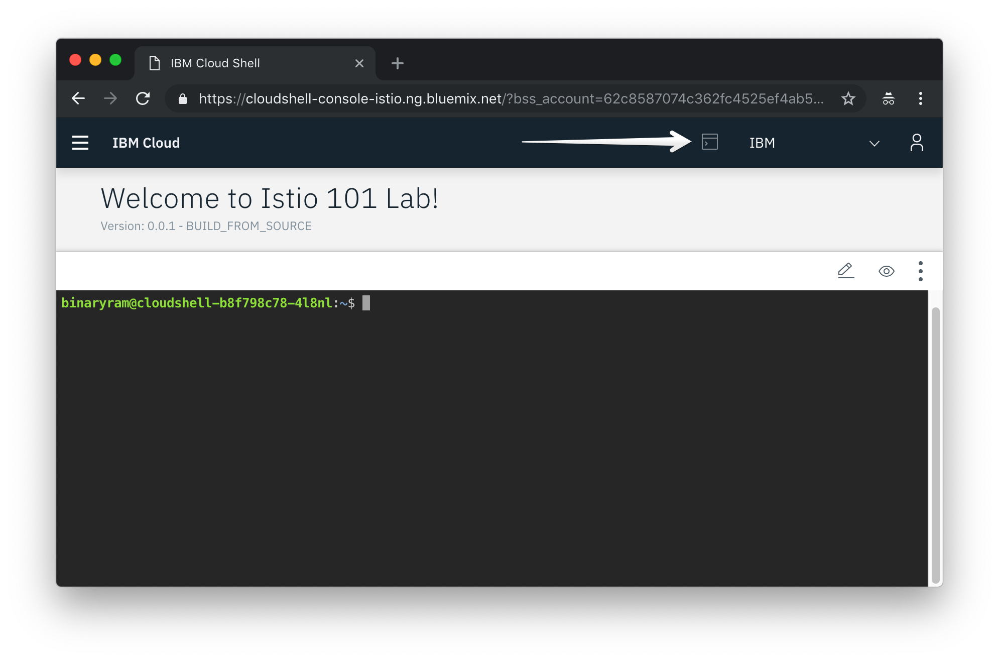

# Exercise 1 - Accessing your Kubernetes Cluster

You must already have an IBM account, with a cluster created or assigned to you as documented in [previous step](../exercise-0/README.md).

## Connect to your cluster using the Cloud Shell
For this lab, a hosted shell is provided for you with all the necessary tools installed. Use this web shell to perform the tasks in this lab. If you are having problems with this web shell, you can set everyting up locally, by following the instructions here(https://github.com/IBM/knative101/tree/master/workshop/exercise-0) instead.

1. Using Chrome or Firefox, go to the [Cloud Shell](https://cloudshell-console-istio.ng.bluemix.net/) and login using the Login button.
2. Passcode is `knativerocks`
3. Using the account drop down, choose the `IBM` account.
4. Click on the Terminal icon to launch your web shell.



## Access your cluster
Learn how to set the context for your cluster in your CLI. Every time you log in to the CLI to work with the cluster, you must run this command to set a path to the cluster's configuration file as a session variable. The Kubernetes CLI uses this variable to find a local configuration file and certificates that are necessary to connect with the cluster in IBM Cloud.

1. List the available clusters.

    ```shell
    ibmcloud ks clusters
    ```

    > Note: If no clusters are shown, make sure you are targeting the right region with `ibmcloud ks region-set`. Choose the same region that you chose when creating the cluster on the [Get Cluster](https://get-cluster.mybluemix.net/) page.

2. Download the configuration file and certificates for your cluster using the `cluster-config` command.

    ```shell
    ibmcloud ks cluster-config <your_cluster_name>
    ```

3. Copy and paste the output command from the previous step to set the `KUBECONFIG` environment variable and configure your CLI to run `kubectl` commands against your cluster.

    Example:
    ```shell
    export KUBECONFIG=/Users...
    ```

4. Validate access to your cluster by viewing the nodes in the cluster.

    ```shell
    kubectl get node
    ```
    
Continue on to [exercise 2](../exercise-2/README.md).