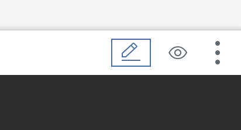
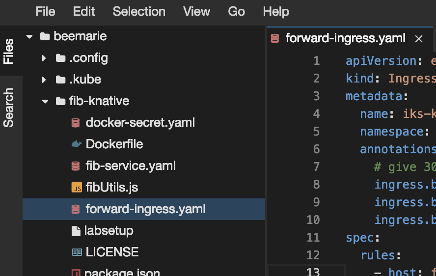

## Update domain configuration for Knative
When a Knative application is deployed, Knative will define a URL for your application. By default, Knative Serving routes use `example.com` as the default domain. We don't actually own anything at `example.com`, so let's create new applications at a domain we do own.

We need to configure Knative to assign new applications to our own domain.

### Get the Ingress Subdomain for your IBM Kubernetes Cluster
What hostname should we use? IBM Kubernetes Service gave us an external domain (ingress subdomain) when we created our cluster. We took note of that ingress subdomain in Exercise 0. If you didn't mark it down, go back to the IBM Cloud [dashboard](https://cloud.ibm.com/containers-kubernetes/clusters) and click on your cluster to find it. It is also stored as an environment variable, so you could just run the following `echo` command:

```shell
echo $MYINGRESS
```

In this exercise, we'll tell Knative to assign new applications to that URL, and then forward any requests sent to the URL to the Knative Istio Gateway.

1. Your ingress subdomain should look something like this:

	```
	Ingress Subdomain:      mycluster6.us-south.containers.appdomain.cloud   
	```

	Ingress is a Kubernetes service that balances network traffic workloads in your cluster by forwarding public or private requests to your apps. This Ingress Subdomain is an externally available and public URL providing access to your cluster. Copy the value of this Ingress Subdomain to the clipboard.

2. Next, update the default URL for new Knative apps by editing the configuration:

	```
	kubectl edit cm config-domain --namespace knative-serving
	```

3. Change all instances of `example.com` to your ingress subdomain, which should look something like: `knative-workshop2.sjc03.containers.appdomain.cloud`. There should be one instance of `example.com` under `data`. New Knative applications will now be assigned a route with this host, rather than `example.com`.  

> Note: This will open vi. Use `i` to insert, `esc` to exit insert mode, `:w` to save, and `:q` to quit.

### Forward specific requests coming into IKS ingress to the Knative Ingress Gateway

1. When requests come in to our fibonacci application through the ingress subdomain, we want them to be forwarded to the Knative ingress gateway. Edit the `forward-ingress.yaml` file with your own ingress subdomain, prepended with `fib-knative.default`. Remember that the fully qualified domain name for a route has the following form: `{route}.{namespace}.{domain}`. To edit the file, first click the pencil icon.

    

2. Click Files along the left side, and then navigate to the `fib-knative/forward-ingress.yaml` file, and update `host` with your own `<ingress_subdomain>`

    

	The file should look something like:

	```yaml
	apiVersion: extensions/v1beta1
	kind: Ingress
	metadata:
		name: iks-knative-ingress
		namespace: istio-system
	spec:
		rules:
			- host: fib-knative.default.<ingress_subdomain>
				http:
					paths:
						- path: /
							backend:
								serviceName: istio-ingressgateway
								servicePort: 80
	```

3. Save the file, and return to the cloudshell.

2. Apply the ingress rule you just created.

	```
	kubectl apply --filename forward-ingress.yaml
	```

### Try it again

Now that we've setup our DNS routing, let's try our `curl` command again using the DNS hostname:

```
curl fib-knative.default.$MYINGRESS/5
```

Expected Output:
```
[1,1,2,3,5]
```

Congratulations, your application now lives at its own domain!

Continue on to [exercise 5](../exercise-5/README.md).